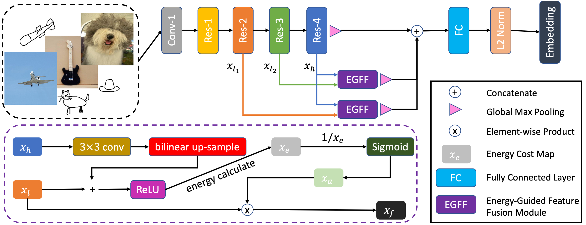

# MSEdge

A PyTorch implementation of MSEdge based on SPL
paper [Edge is All You Need: Multi-scale Edge Fusion for Zero-shot Sketch-based Image Retrieval]().



## Requirements

- [Anaconda](https://www.anaconda.com/download/)
- [PyTorch](https://pytorch.org)

```
conda install pytorch=1.9.0 torchvision cudatoolkit -c pytorch
```

- [Pytorch Metric Learning](https://kevinmusgrave.github.io/pytorch-metric-learning/)

```
pip install pytorch-metric-learning
```

- [Faiss](https://faiss.ai)

```
conda install -c pytorch faiss-cpu
```

- [Kornia](https://kornia.readthedocs.io)

```
pip install kornia
```

- [Timm](https://rwightman.github.io/pytorch-image-models/)

```
pip install timm
```

## Dataset

[Sketchy Extended](http://sketchy.eye.gatech.edu) and
[TU Berlin](http://cybertron.cg.tu-berlin.de/eitz/projects/classifysketch/) datasets are used in this repo, you could
download these datasets from official websites, or download them from
[MEGA](https://mega.nz/folder/IooQkZRJ#jLYcZ5PFK9jzxLN4FuOopg). The data directory structure is shown as follows:

 ```
├──sketchy
   ├── train
       ├── sketch
           ├── airplane
               ├── n02691156_58-1.jpg
               └── ...
           ...
       ├── photo
           same structure as sketch
   ├── val
      same structure as train
      ...
├──tuberlin
   same structure as sketchy
   ...
```

## Usage

```
python main.py --data_name tuberlin
optional arguments:
--data_root                   Datasets root path [default value is 'data']
--data_name                   Dataset name [default value is 'sketchy'](choices=['sketchy', 'tuberlin'])
--backbone_type               Backbone type [default value is 'resnet50'](choices=['resnet50', 'vgg16'])
--proj_dim                    Projected embedding dim [default value is 512]
--batch_size                  Number of images in each mini-batch [default value is 64]
--epochs                      Number of epochs over the model to train [default value is 10]
--warmup                      Number of warmups over the model to train [default value is 2]
--save_root                   Result saved root path [default value is 'result']
```

## Benchmarks

The models are trained on one NVIDIA GTX TITAN (12G) GPU. `Adam` is used to optimize the model, `lr` is `1e-5`
and `weight decay` is `5e-4`. all the hyper-parameters are the default values.

<table>
<thead>
  <tr>
    <th rowspan="2">Backbone</th>
    <th rowspan="2">Dim</th>
    <th colspan="4">Sketchy Extended</th>
    <th colspan="4">TU Berlin</th>
    <th rowspan="2">Download</th>
  </tr>
  <tr>
    <td align="center">mAP@200</td>
    <td align="center">mAP@all</td>
    <td align="center">P@100</td>
    <td align="center">P@200</td>
    <td align="center">mAP@200</td>
    <td align="center">mAP@all</td>
    <td align="center">P@100</td>
    <td align="center">P@200</td>
  </tr>
</thead>
<tbody>
  <tr>
    <td align="center">VGG16</td>
    <td align="center">64</td>
    <td align="center">29.3</td>
    <td align="center">33.3</td>
    <td align="center">45.3</td>
    <td align="center">58.6</td>
    <td align="center">29.3</td>
    <td align="center">33.3</td>
    <td align="center">45.3</td>
    <td align="center">58.7</td>
    <td align="center"><a href="https://pan.baidu.com/s/1yZhkba1EU79LwqgizDzTUA">agdw</a></td>
  </tr>
  <tr>
    <td align="center">VGG16</td>
    <td align="center">512</td>
    <td align="center">29.3</td>
    <td align="center">33.3</td>
    <td align="center">45.3</td>
    <td align="center">58.6</td>
    <td align="center">29.3</td>
    <td align="center">33.3</td>
    <td align="center">45.3</td>
    <td align="center">58.7</td>
    <td align="center"><a href="https://pan.baidu.com/s/1yZhkba1EU79LwqgizDzTUA">agdw</a></td>
  </tr>
  <tr>
    <td align="center">ResNet50</td>
    <td align="center">128</td>
    <td align="center">29.3</td>
    <td align="center">33.3</td>
    <td align="center">45.3</td>
    <td align="center">58.6</td>
    <td align="center">29.3</td>
    <td align="center">33.3</td>
    <td align="center">45.3</td>
    <td align="center">58.7</td>
    <td align="center"><a href="https://pan.baidu.com/s/139IHtS2_tOZcEK2Qgt-yQw">5dzs</a></td>
  </tr>
  <tr>
    <td align="center">ResNet50</td>
    <td align="center">512</td>
    <td align="center"><b>69.3</b></td>
    <td align="center"><b>73.3</b></td>
    <td align="center"><b>81.3</b></td>
    <td align="center"><b>88.0</b></td>
    <td align="center"><b>69.3</b></td>
    <td align="center"><b>73.3</b></td>
    <td align="center"><b>81.3</b></td>
    <td align="center"><b>88.0</b></td>
    <td align="center"><a href="https://pan.baidu.com/s/139IHtS2_tOZcEK2Qgt-yQw">5dzs</a></td>
  </tr>
</tbody>
</table>

## Results

### Sketchy Extended


### TU Berlin


